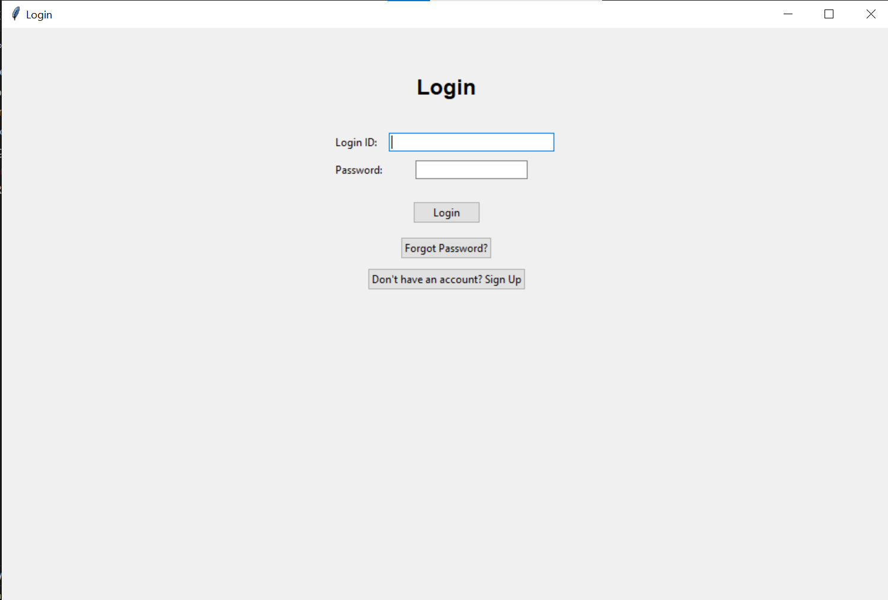
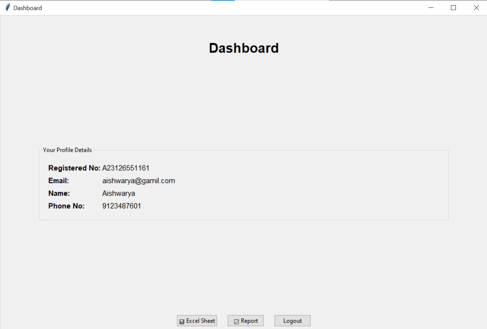

# Cargo Data Management Application

A Python Tkinter-based desktop application developed during my Data Analytics Internship at **Visakhapatnam Port Trust** for managing tabular operational data.

The application provides a graphical interface for importing, editing, searching, filtering, sorting, saving, and exporting CSV-based data.

> **Data note:** This repository should use synthetic demonstration data only. Original Port Trust data is not included.

## Features

- CSV import and export
- Tabular data editing
- Add and remove rows
- Add and remove columns
- Column sorting
- Column filtering
- Value search
- Undo and redo
- Local sheet persistence using JSON
- User registration and login
- Password hashing using SHA-256

## Technology Stack

- Python
- Tkinter / ttk
- CSV
- JSON
- File handling

## Workflow

```text
CSV / Cargo Data
       |
       v
   Import CSV
       |
       v
 View / Edit Data
       |
       +------> Search
       |
       +------> Filter
       |
       +------> Sort
       |
       v
 Save / Persist
       |
       v
 Export CSV
```

## Screenshots

### Login


### Sheet Editor


## Sample Data

A synthetic cargo dataset can be placed in `sample_data/cargo_sample.csv` for demonstration.

Example fields:

- Cargo ID
- Cargo Type
- Quantity
- Origin
- Destination
- Year


## How to Run

```bash
python main.py
```

If the Python file has a different name, replace `main.py` with the actual filename.

## Individual Contribution

Based on the available project code, the application includes implementation for:

- Tkinter-based desktop interface
- CSV import and export
- Tabular data editing
- Sorting and filtering
- Search functionality
- Undo/redo
- Local JSON persistence
- User authentication

## Project Context

This application was developed during my Data Analytics Internship at Visakhapatnam Port Trust as part of a workflow for handling operational tabular data.

## Limitations

- The application is a desktop Tkinter application.
- The available implementation does not include an advanced statistical analytics engine, machine-learning model, or Power BI integration.
- The repository should use synthetic data for public demonstration.
